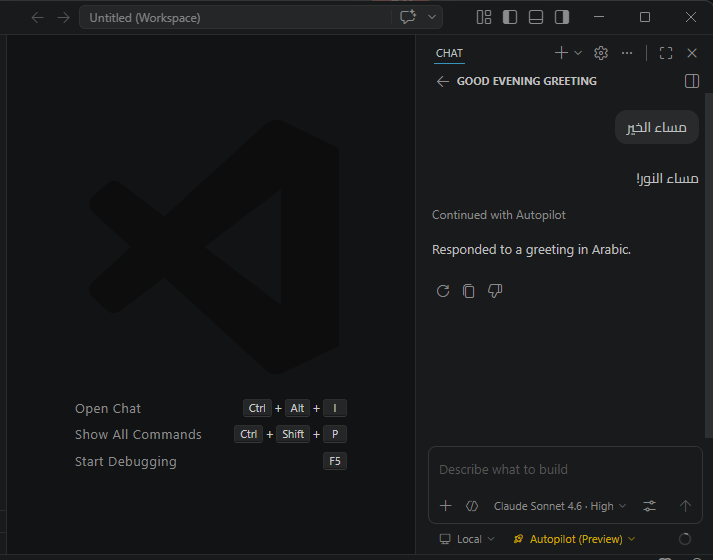
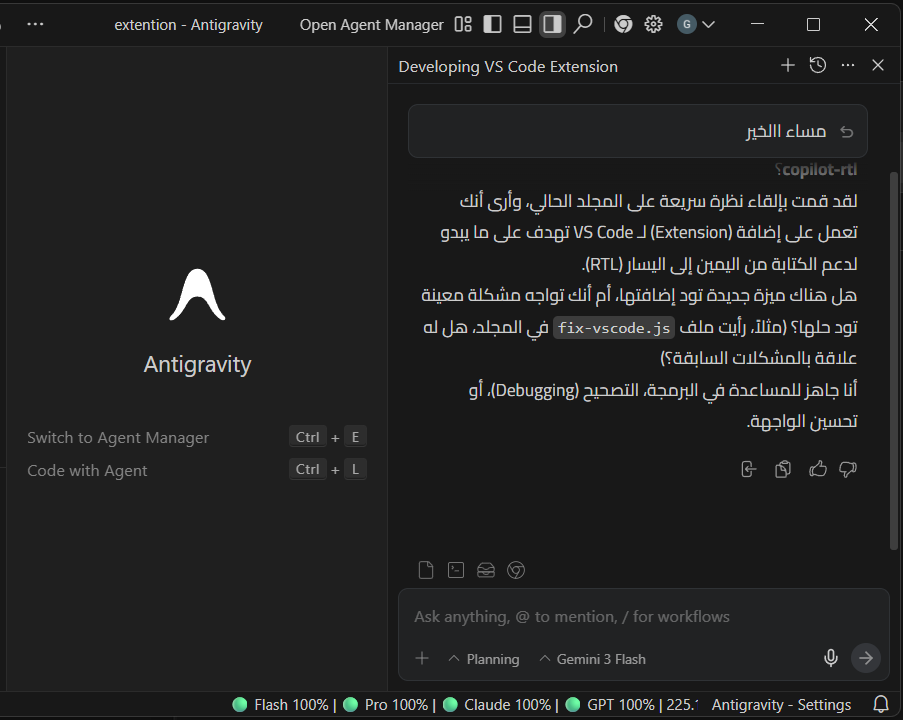

# Copilot RTL

Adds automatic **RTL (Right-to-Left)** support to VS Code Copilot chat for Arabic and mixed Arabic/English text.

- Arabic or mixed text → RTL direction + your chosen font & size
- English-only text → LTR with optional custom font & size
- Code blocks → always LTR (untouched)

---

## Screenshots

**VS Code**



**Antigravity**



---

## Usage

Open the Command Palette (`Ctrl+Shift+P`) and run:

| Command | Description |
|---|---|
| `Copilot RTL: Enable` | Inject RTL patch and reload VS Code |
| `Copilot RTL: Disable` | Remove RTL patch and reload VS Code |
| `Copilot RTL: Show Status` | Check if the patch is currently active |

> **Note:** VS Code may show a warning that the installation is modified — this is expected. If you see a permissions error, restart VS Code as Administrator.

---

## Settings

1. Open **Settings** (`Ctrl+,`)
2. Search for **Copilot RTL**

> **Antigravity users:** `Ctrl+,` opens Antigravity's own settings, not VS Code settings.
> To access Copilot RTL settings in Antigravity, open the Command Palette (`Ctrl+Shift+P`) and search for **"Preferences: Open Settings (UI)"**, then search for **Copilot RTL**.

### Arabic (RTL) text

| Setting | Default | Description |
|---|---|---|
| `copilotRtl.fontFamily` | `vazirmatn` | Font for Arabic text (e.g. `Cairo`, `Tahoma`, `Arial`) |
| `copilotRtl.fontSize` | `13` | Font size in pixels (8–40) |
| `copilotRtl.lineHeight` | `1.8` | Line spacing for Arabic text (1–4) |

### English (LTR) text

| Setting | Default | Description |
|---|---|---|
| `copilotRtl.ltrFontFamily` | *(empty)* | Font for English text — leave empty to use VS Code default |
| `copilotRtl.ltrFontSize` | `0` | Font size in pixels — set to `0` to use VS Code default |
| `copilotRtl.ltrLineHeight` | `0` | Line spacing — set to `0` to use VS Code default |

After changing any setting, VS Code will automatically prompt you to **Reload** to apply the change.

> **Tip:** If the Arabic font isn't installed on your system, a warning will appear in the DevTools console (`Help → Toggle Developer Tools`).

---

## Install from VSIX

```
code --install-extension copilot-rtl-x.x.x.vsix
```

Or via Extensions panel → `...` → **Install from VSIX...**
